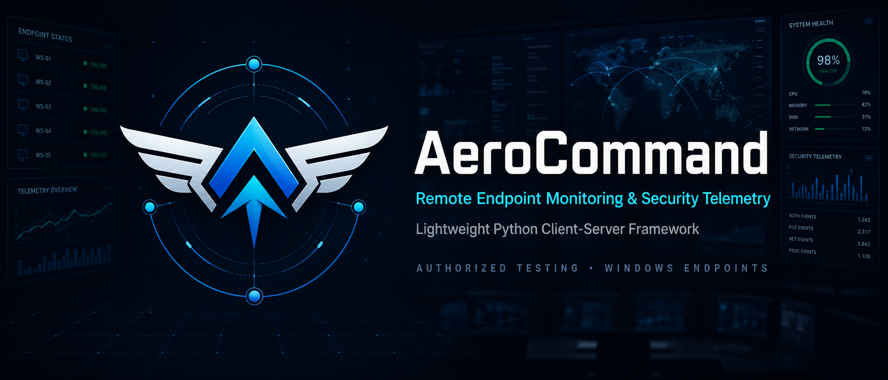

<p align="center">

</p>
<p align="center">
  <strong>Lightweight Python and Tauri C2 & endpoint administration framework for authorized monitoring, security telemetry testing, and lab demonstrations.</strong>
</p>
<p align="center">
  <em>Designed for isolated labs, controlled demonstrations, and approved security research.</em>
</p>

---

## Table of Contents

1. [Overview](#overview)
2. [Key Capabilities](#key-capabilities)
3. [System Architecture](#system-architecture)
4. [Repository Structure](#repository-structure)
5. [Prerequisites & Environment Setup](#prerequisites--environment-setup)
6. [Operator Guide & Deployment](#operator-guide--deployment)
   - [Running the Management Server](#1-running-the-management-server)
   - [Launching the Tauri Operator Dashboard](#2-launching-the-tauri-operator-dashboard)
   - [Deploying and Configuring the Endpoint Client](#3-deploying-and-configuring-the-endpoint-client)
   - [Building Standalone Executables](#4-building-standalone-executables)
7. [Command Reference](#command-reference)
8. [Communication Protocol & Security Model](#communication-protocol--security-model)
9. [Troubleshooting & FAQ](#troubleshooting--faq)
10. [Disclaimer & Compliance](#disclaimer--compliance)

---

## Overview

**AeroCommand** is a modern, modular client-server framework engineered for studying endpoint administration workflows, command execution pipelines, and security telemetry in controlled environments. It integrates a high-performance Rust/Python management backend, a sleek modern **Tauri v2 + React** desktop dashboard (`aerocommand-tauri/`), an alternative Python CustomTkinter control panel (`control_panel.py`), and a Windows-focused endpoint client (`client.py`) featuring live diagnostic streaming, high-performance directory exploration, and instant previewing.

The project is strictly intended for **defensive research, system administration exercises, and isolated security simulations**. It must not be used to access, monitor, control, or collect data from systems without explicit, documented permission.

> **Important:** Run this project exclusively on systems you own or are expressly authorized to test. Do not expose the management server to the public internet or deploy the endpoint client on third-party devices.

---

## Key Capabilities

| Component / Area | Functionality & Technical Implementation |
| --- | --- |
| **Tauri Desktop Dashboard** | Modern Tauri v2 + React 19 + Tailwind interface featuring dark glassmorphism, real-time client status tracking, telemetry charts, interactive terminal, and process manager. |
| **Remote File Explorer** | High-performance directory navigation powered by optimized file scanning (`os.scandir()`) and structured JSON serialization with clickable breadcrumbs, history, and quick-access folders. |
| **Instant Live Previews** | In-modal previewing of remote images (PNG, JPG, ICO, WebP) with zoom controls and transparency support, alongside UTF-8 text/script viewer. |
| **OneDrive & Shell Resolution** | Dynamic Windows Registry querying (`User Shell Folders`) that automatically resolves paths for folders redirected to OneDrive (Desktop, Documents, Pictures, etc.). |
| **Telemetry & Diagnostics** | Real-time CPU, RAM, Network, and Disk usage metrics along with system information, process listing, and process termination. |
| **Command Delivery** | Interactive terminal queuing with real-time polling, result delivery, and SQLite execution history. |
| **Artifact Collection** | One-click artifact downloads and loot gallery organized under `./loot/<hostname>/`. |
| **Clipboard Stream** | Real-time clipboard monitoring with automatic logging to the management server. |

---

## System Architecture

AeroCommand consists of modular backend services and operator interfaces communicating over standard HTTP/HTTPS with XOR obfuscation:

| Component | Path / File | Responsibility |
| --- | --- | --- |
| **Tauri Desktop App** | `aerocommand-tauri/` | Modern Rust + React desktop GUI with live client metrics, terminal, process manager, and remote file explorer. |
| **Management Server** | `server.py` | Standalone Flask-based management server with SQLite session & command logging (`aerocommand.db`). |
| **CustomTkinter GUI** | `control_panel.py` | Lightweight Python desktop GUI for operator management and loot visualization. |
| **Endpoint Client** | `client.py` | Polling client supporting diagnostics, instant previews, file browsing, persistence checks, and command execution. |

```
┌─────────────────────────────────────────┐       HTTP Polling / JSON       ┌──────────────────────────┐
│         AeroCommand Control Panel       │  ◄────────────────────────────► │     Windows Endpoint     │
│       Tauri v2 GUI / server.py          │                                 │        client.py         │
│                                         │                                 │                          │
│  • Real-time Telemetry Dashboard        │                                 │  • System Diagnostics    │
│  • Remote File Explorer & Previews      │                                 │  • Live File Previews    │
│  • Interactive Command Terminal         │                                 │  • Process Telemetry     │
│  • Process Manager & Termination        │                                 │  • Result Delivery       │
│  • Loot Gallery & SQLite Logs           │                                 │  • Shell Resolution      │
└─────────────────────────────────────────┘                                 └──────────────────────────┘
```

---

## Repository Structure

```
.
├── aerocommand-tauri/        # Tauri v2 + React 19 operator desktop application
│   ├── src/                  # React dashboard, terminal, file explorer, preview modal
│   └── src-tauri/            # Rust C2 backend, DB handlers, and native bridge
├── assets/                   # Graphical assets and banners
├── build/                    # Build artifacts and intermediate files
├── dist/                     # Compiled PyInstaller executables (e.g., WindowsUpdate.exe)
├── loot/                     # Downloaded files, screenshots, and collected artifacts
├── venv/                     # Python virtual environment
├── client.py                 # Windows endpoint agent (diagnostics, scandir, previews)
├── client.spec               # PyInstaller standalone build specification
├── control_panel.py          # Alternative CustomTkinter Python desktop GUI
├── server.py                 # Standalone Flask-based C2 management server
├── requirements.txt          # Python dependencies (Flask, Pillow, requests, etc.)
├── aerocommand.db            # SQLite history and client records
└── README.md                 # Project documentation
```

---

## Prerequisites & Environment Setup

### System Requirements

| Requirement | Supported Environment / Version |
| --- | --- |
| **Python** | Python 3.10 or newer (with `pip`) |
| **Node.js & Package Manager** | Node.js 18+ with `pnpm` (required for Tauri frontend) |
| **Rust Toolchain** | Stable Rust toolchain (`rustc`, `cargo`) for building Tauri v2 backend |
| **Endpoint Client OS** | Windows 10 or Windows 11 test systems |
| **Management Server OS** | Windows or Linux laboratory host |

### Installation Steps

1. **Clone or Navigate to the Repository:**
   Ensure you are in the project root directory.

2. **Install Python Dependencies:**
   ```powershell
   pip install -r requirements.txt
   ```

3. **Install Tauri Frontend Dependencies:**
   ```powershell
   cd aerocommand-tauri
   pnpm install
   cd ..
   ```

4. **Configure Environment Variables:**
   Copy `.env.example` to `.env` and set your secrets:
   ```powershell
   cp .env.example .env
   ```
   Then edit `.env` and set:
   ```env
   C2_DOMAIN=http://127.0.0.1:443/
   PORT=443
   OPERATOR_TOKEN=your-secret-operator-token-here
   ```
   > **Important:** Choose a strong random token for `OPERATOR_TOKEN`. This token authenticates the operator dashboard to the server's API endpoints.

---

## Operator Guide & Deployment

### 1. Running the Management Server
Start the Flask management server to handle endpoint registrations, command queuing, and result logging:
```powershell
python server.py
```
By default, the server initializes an SQLite database (`aerocommand.db`) and listens for incoming agent check-ins.

### 2. Launching the Tauri Operator Dashboard
To run the modern desktop control panel in development mode:
```powershell
cd aerocommand-tauri
pnpm tauri dev
```
The Tauri application launches the operator interface, providing real-time telemetry, terminal access, and file management.

### 3. Deploying and Configuring the Endpoint Client
Before running or compiling `client.py`, update the configuration block in `client.py`:
```python
# client.py configuration
C2_DOMAIN = "http://127.0.0.1:443/"  # Laboratory server address
POLLING_DELAY = 5                     # Polling frequency in seconds
JITTER = 2                            # Random delay range in seconds
ANTI_VM = False                       # Set to False for local testing/VMs
```

Run the endpoint agent on the test Windows system:
```powershell
python client.py
```

### 4. Building Standalone Executables
To compile a standalone Windows client executable using PyInstaller:
```powershell
pyinstaller .\client.spec --noconfirm
```
The compiled executable will be generated at:
```
./dist/WindowsUpdate.exe
```

---

## Command Reference

The management console and interactive terminal support a comprehensive suite of endpoint administration commands:

### Session & Diagnostics

| Command | Description |
| --- | --- |
| `sysinfo` | Retrieves hardware specs, OS version, active user, network configuration, and administrator privileges. |
| `ps` | Lists running processes with PID, memory usage, CPU percentage, and window titles in structured JSON. |
| `killproc <pid/name>` | Terminates a target process on the remote endpoint. |
| `screenshot` | Captures the remote screen and saves the image to `./loot/<hostname>/`. |
| `pwd` | Returns the current working directory of the agent process. |
| `cd <path>` | Changes the current working directory on the remote endpoint. |

### File Exploration & Previews

| Command | Description |
| --- | --- |
| `ls [path]` | High-speed directory listing returning structured JSON (`[JSON_FILES]`) with type, size, and modification date. |
| `preview <path>` | Streams an instant preview of images (PNG, JPG, ICO, WebP) or UTF-8 text files to the preview modal. |
| `download <path>` | Downloads a remote file and saves it securely into the local loot store. |
| `upload <url> <dst>` | Instructs the remote client to download a file from an approved URL to the specified destination. |

### Utilities & Telemetry

| Command | Description |
| --- | --- |
| `clip` | Reads the current clipboard text buffer. |
| `clipwatch` | Starts real-time clipboard monitoring and logs changes to the management server. |
| `clipstop` | Stops clipboard monitoring. |
| `sleep <seconds>` | Adjusts the client polling interval dynamically (1–3600 seconds). |
| `dialog <title> \| <msg>` | Displays a native Windows alert message box on the client desktop. |
| `persist` | Verifies or establishes startup persistence in the user Startup folder. |
| `kill` | Commands the client process to self-destruct and exit cleanly. |

---

## Communication Protocol & Security Model

AeroCommand uses HTTP/HTTPS with hybrid RSA-2048 + AES-256-GCM encryption for all endpoint-client traffic, and Bearer token authentication for operator API access:

### Endpoint ↔ Server Encryption
- **Registration:** Client fetches the server's RSA-2048 public key, generates a random AES-256 session key, wraps it with RSA-OAEP, and sends it alongside the encrypted registration payload
- **Subsequent requests:** All command and result traffic is AES-256-GCM encrypted using the per-client session key (nonce + tag + ciphertext, all Base64 encoded)
- **No plaintext fallback:** Decryption failures return `None` — the channel cannot silently degrade to plaintext

| Route | HTTP Method | Purpose |
| --- | --- | --- |
| `/rsa_pub` | `GET` | Server RSA-2048 public key for client key exchange |
| `/register` | `POST` | Initial endpoint handshake and system telemetry (hybrid RSA+AES encrypted) |
| `/cmd` | `GET` | Polling endpoint for retrieving queued operator instructions (AES encrypted) |
| `/result` | `POST` | Delivering execution output, diagnostics, and structured telemetry data |
| `/upload` | `POST` | Streaming binary artifacts and downloaded loot to the management server |

### Operator API Authentication
All `/api/` endpoints require a valid Bearer token set via the `OPERATOR_TOKEN` environment variable. Requests without a matching `Authorization: Bearer <token>` header are rejected with HTTP 401.

| Route | HTTP Method | Purpose |
| --- | --- | --- |
| `/api/clients` | `GET` | List all registered endpoints (auth required) |
| `/api/logs` | `GET` | Retrieve command history (auth required) |
| `/api/send_command` | `POST` | Queue a command for a target endpoint (auth required) |
| `/api/loot` | `GET` | List collected artifacts (auth required) |

---

## Troubleshooting & FAQ

### Common Issues and Solutions

1. **Tauri Build Errors (`pnpm tauri dev`):**
   - *Cause:* Missing Rust toolchain or WebView2 runtime.
   - *Solution:* Ensure Rust is installed (`rustc --version`) and Visual Studio C++ build tools are present on Windows.
2. **Client Connection Refused:**
   - *Cause:* `C2_DOMAIN` mismatch or management server not running.
   - *Solution:* Verify `server.py` is active on the designated port and that Windows Firewall permits local loopback/network connections in your lab.
3. **PyInstaller Executable Flagged by Defender:**
   - *Cause:* Standard behavior for script-based packers (`pyinstaller`) compiled with generic names in lab environments.
   - *Solution:* Add an exclusion path in Windows Defender for your isolated lab directory during authorized testing.

---

## Disclaimer

> **FOR EDUCATIONAL AND AUTHORIZED SECURITY RESEARCH / LAB TESTING ONLY.** AeroCommand is intended solely for authorized system administration, security auditing, and educational simulations in isolated laboratory environments. Unauthorized access to computer systems, interception of data, persistence on devices, or collection of information is illegal under applicable local, national, and international laws. The maintainers and contributors assume no liability for misuse or damage caused by this software.
